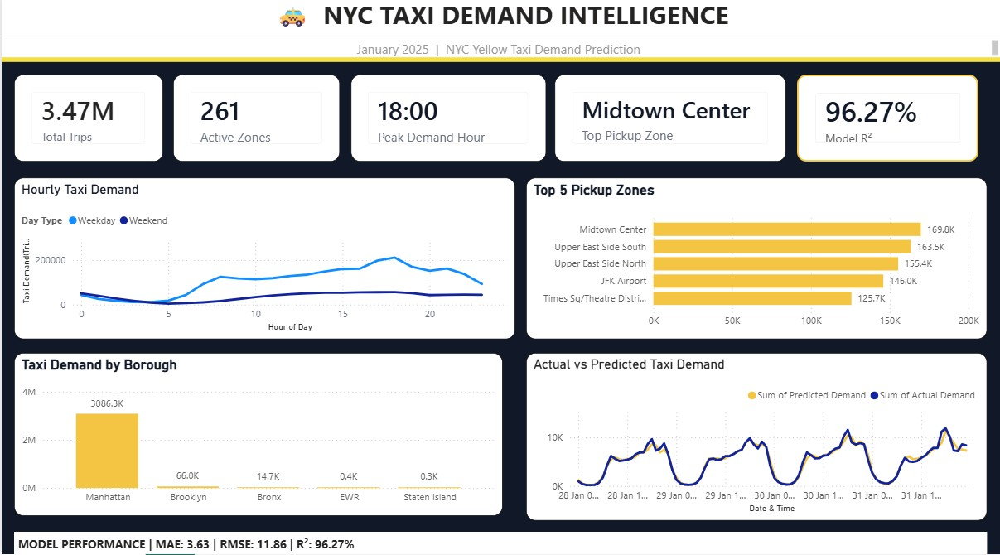

# NYC Taxi Demand Prediction

An end-to-end data analytics and machine learning project that analyzes NYC taxi demand patterns and predicts hourly pickup demand across different pickup zones.

The project combines data cleaning, exploratory analysis, feature engineering, machine learning, and Power BI visualization to understand demand patterns and evaluate the performance of a taxi demand prediction model.

---

## Power BI Dashboard




## Project Overview

Taxi demand varies significantly by hour, day, and pickup location. Understanding these patterns can help identify high-demand periods and locations.

This project analyzes NYC Yellow Taxi trip data and builds a machine learning model to predict hourly taxi demand by pickup zone.

The project workflow includes:

- Data cleaning and preprocessing
- Exploratory data analysis
- Hourly and zone-level demand aggregation
- Feature engineering
- Time-based train, validation, and test splitting
- Random Forest regression
- Model evaluation
- Feature importance analysis
- Power BI dashboard development

---

## Objectives

The main objectives of this project were to:

- Analyze taxi demand patterns across different hours and pickup zones
- Identify high-demand pickup locations
- Compare weekday and weekend demand patterns
- Create time-based features for demand prediction
- Build a machine learning model for hourly taxi demand
- Evaluate model performance using MAE, RMSE, and R²
- Understand which features contribute most to predictions
- Present the findings through an interactive Power BI dashboard

---

## Dataset

The project uses NYC Yellow Taxi trip data.

The data was transformed into hourly demand records by pickup zone for analysis and modeling.

After preprocessing and feature engineering, the dataset contained:

- **261 unique pickup zones**
- **144,072 training rows**
- **18,792 validation rows**
- **25,056 testing rows**

The final dashboard reports approximately **3.47 million taxi trips** for the analyzed period.

---

## Data Cleaning and Preprocessing

The raw taxi trip data was processed before performing analysis and modeling.

The preprocessing workflow included:

1. Loading the taxi trip data
2. Inspecting the dataset structure
3. Handling invalid or unusable records
4. Converting pickup timestamps into datetime format
5. Extracting time-related information
6. Identifying pickup zones
7. Aggregating trips into hourly demand
8. Preparing the data for feature engineering
9. Removing rows affected by lag and rolling calculations where required

The cleaned data was then used for both exploratory analysis and machine learning.

---

## Exploratory Data Analysis

The analysis focused on understanding how taxi demand changes over time and across locations.

Key areas analyzed included:

- Demand by hour
- Demand by day type
- Demand by pickup zone
- Demand by borough
- High-demand pickup locations
- Actual versus predicted demand

The analysis showed that taxi demand varies considerably throughout the day, with demand reaching its highest level around the evening period.

---

## Feature Engineering

Time-based and historical demand features were created for the machine learning model.

The main features used were:

| Feature | Description |
|---|---|
| `PULocationID` | Pickup zone identifier |
| `hour` | Hour of the day |
| `day_of_week` | Day of the week |
| `day_of_month` | Day of the month |
| `is_weekend` | Indicates whether the day is a weekend |
| `lag_1` | Demand from the previous hour |
| `lag_24` | Demand from the same hour on the previous day |
| `rolling_24` | Rolling 24-hour demand feature |

These features were designed to capture both time patterns and recent historical demand.

---

## Machine Learning Model

A **Random Forest Regression** model was trained to predict hourly taxi demand.

The data was divided chronologically into:

- **Training:** 144,072 rows
- **Validation:** 18,792 rows
- **Testing:** 25,056 rows

A time-based split was used so that future observations were not used to train the model.

### Model Evaluation

The model was first evaluated on the validation dataset.

### Validation Performance

| Metric | Result |
|---|---:|
| MAE | 4.17 |
| RMSE | 13.45 |
| R² | 0.9402 |

The model was then evaluated on the unseen test dataset.

### Final Test Performance

| Metric | Result |
|---|---:|
| MAE | **3.63** |
| RMSE | **11.86** |
| R² | **0.9627** |

The final test R² of **0.9627** indicates that the model explained approximately 96.27% of the variance in the test demand data.

---

## Baseline Comparison

A baseline model was also evaluated before comparing it with the Random Forest model.

### Baseline Performance

| Metric | Baseline |
|---|---:|
| MAE | 5.43 |
| RMSE | 17.91 |
| R² | 0.8938 |

### Random Forest Test Performance

| Metric | Random Forest |
|---|---:|
| MAE | 3.63 |
| RMSE | 11.86 |
| R² | 0.9627 |

The Random Forest model produced lower MAE and RMSE and a higher R² than the baseline.

---

## Feature Importance

Feature importance from the Random Forest model showed that recent historical demand was the most influential feature.

| Feature | Importance |
|---|---:|
| `lag_1` | 0.894862 |
| `lag_24` | 0.073075 |
| `hour` | 0.011241 |
| `rolling_24` | 0.008184 |
| `day_of_week` | 0.005440 |
| `PULocationID` | 0.003832 |
| `day_of_month` | 0.002943 |
| `is_weekend` | 0.000423 |

The previous-hour demand (`lag_1`) was the dominant feature, followed by demand from the same hour on the previous day (`lag_24`).

As an additional check, the model was also trained without `lag_1`.

### Model Without `lag_1`

| Metric | Result |
|---|---:|
| MAE | 3.98 |
| RMSE | 12.71 |
| R² | 0.9572 |

This showed that the model still performed strongly without the previous-hour demand feature, although performance decreased compared with the full model.

---

## Power BI Dashboard

A Power BI executive dashboard was created to present the analytical and machine learning results in an easy-to-understand format.

The dashboard includes:

### KPI Cards

- Total Trips
- Active Zones
- Peak Demand Hour
- Top Pickup Zone
- Model R²

### Visualizations

- Hourly Taxi Demand
- Top 5 Pickup Zones
- Taxi Demand by Borough
- Actual vs Predicted Taxi Demand
- Model Performance summary

The dashboard provides both business-level demand insights and model performance information in a single view.

---

## Key Insights

### 1. Demand varies significantly by hour

Taxi demand changes throughout the day, with demand increasing during the daytime and reaching a high point around the evening.

### 2. Demand is concentrated in specific pickup zones

A small number of pickup zones account for a large share of the observed demand.

The dashboard identifies **Midtown Center** as the top pickup zone in the analyzed data.

### 3. Historical demand is highly important for prediction

The feature importance analysis shows that `lag_1` was the most influential model feature, followed by `lag_24`.

This indicates that recent and previous-day demand patterns provide strong information for predicting the next hourly demand level.

### 4. The model closely follows actual demand

The Actual vs Predicted visualization shows that the predicted demand generally follows the pattern of the actual demand across the test period.

### 5. Random Forest outperformed the baseline

The Random Forest model achieved:

- MAE: **3.63**
- RMSE: **11.86**
- R²: **0.9627**

compared with the baseline:

- MAE: 5.43
- RMSE: 17.91
- R²: 0.8938

---

## Tools and Technologies

- **Python**
- **Pandas**
- **NumPy**
- **Matplotlib**
- **Scikit-learn**
- **Jupyter Notebook**
- **Power BI**
- **Parquet**
- **CSV**

---

## Project Workflow

```text
NYC Taxi Trip Data
        ↓
Data Cleaning & Preprocessing
        ↓
Exploratory Data Analysis
        ↓
Hourly Zone-Level Demand
        ↓
Feature Engineering
        ↓
Time-Based Train / Validation / Test Split
        ↓
Random Forest Regression
        ↓
Model Evaluation
        ↓
Feature Importance Analysis
        ↓
Test Predictions
        ↓
Power BI Executive Dashboard
```
